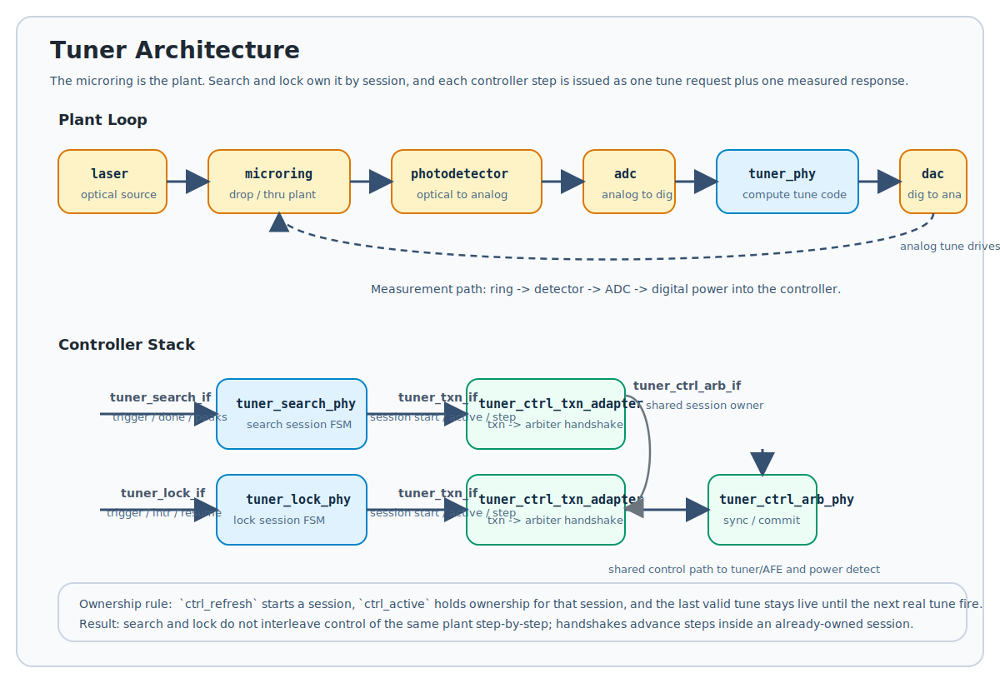

# SystemVerilog WDM Simulation Project

This project is a collection of SystemVerilog modules and C++ testbenches for simulating a Wavelength Division Multiplexing (WDM) system with microring resonators. The project uses Verilator to compile the SystemVerilog code into C++ for high-performance simulation.

## Project Structure

```
.
├── cmake/            # CMake helper scripts
├── docs/             # Sphinx documentation
├── lib/              # RTL libraries
│   ├── cpp/
│   └── verilog/
│       ├── circuits/
│       ├── photonics/
│       └── tuner/
├── sim/              # Simulation testbenches
└── src/              # Source files (not extensively used)
```

### RTL Libraries (`lib/verilog/`)

The `lib/verilog/` directory contains the core SystemVerilog modules for the WDM system.

*   **`circuits/`**: Basic analog and mixed-signal components like ADCs and DACs.
*   **`photonics/`**: Models for optical components, including:
    *   `laser.sv`: A multi-wavelength laser source.
    *   `microring.sv`: A single microring resonator.
    *   `microringrow.sv`: A row of microring resonators.
    *   `photodetector.sv`: A photodetector to convert optical power to electrical current.
*   **`tuner/`**: Control logic for tuning the microring resonators.
    *   `tuner_search_phy.sv`: Sweeps the tuning voltage to find resonance peaks.
    *   `tuner_lock_phy.sv`: Locks the microring's resonance to a specific wavelength.

Package compile order is defined in `cmake/VerilogPackages.cmake`.  Adjust this
file if additional packages are added or the order needs to change.

### Tuner Architecture

The tuner is organized as a closed loop around the microring plant.



Physical path:

- `laser` generates optical waves
- `microring` transforms those waves into `drop` and `thru` outputs
- `photodetector` converts optical power to electrical current
- `adc` converts that current into digital measurement codes
- `tuner_phy` computes the next digital tune code
- `dac` converts the digital tune code back into an analog tuning signal
- that analog tuning signal drives the `microring`

Controller path:

- `tuner_search_if` and `tuner_lock_if` carry lifecycle control such as
  trigger, done, interrupt, resume, and monitor state
- `tuner_search_phy` and `tuner_lock_phy` both issue one tune request plus one
  measured response through `tuner_txn_if`
- `tuner_ctrl_txn_adapter` bridges those controller transactions onto the
  shared arbiter interface
- `tuner_ctrl_arb_phy` performs the shared tune / sync / commit sequencing and
  feeds the AFE and power-detect path

The important ownership rule is that plant control is session-scoped, not
handshake-scoped. Search or lock keeps ownership for the duration of its active
session, and the live tune code remains held until the next real tune fire.

### Simulation (`sim/`)

The `sim/` directory contains the C++ testbenches for simulating the RTL modules. Each subdirectory is a self-contained simulation environment.

*   Each testbench has a `dut.sv` (Design Under Test) and a `tb.cpp` (testbench).
*   The `tb.cpp` file drives the simulation, provides inputs to the DUT, and checks the outputs.
*   The project uses CMake to build and run the simulations.

## Building and Running Simulations

To build the project, you will need to have CMake and Verilator installed. If Verilator is not installed system-wide, set the `VERILATOR_ROOT` environment variable to point to the Verilator installation directory so CMake can locate it.

1.  Configure the build directory:
    ```bash
    cmake -S . -B build
    ```

2.  Build all simulations (setting `VERILATOR_ROOT` if needed):):
    ```bash
    export VERILATOR_ROOT=/opt/verilator  # adjust path to your installation
    cmake --build build -j
    ```

3.  Run a specific simulation:
    ```bash
    cmake --build build --target run-<simulation_name> -j1
    ```
    For example, to run the `hello_world` simulation:
    ```bash
    cmake --build build --target run-hello_world -j1
    ```

4.  Run the tuner simulations with the helper script:
    ```bash
    ./scripts/run_tuner_sims.sh
    ```

## Waveform Viewing With Surfer

If `surfer` is installed, sourcing `sourceme.sh` will point `WAVEFORM_VIEWER` at the repo-local launcher in `scripts/open_wave_surfer.sh`. Existing `make wave-<simulation_name>` targets will then open Surfer instead of GTKWave.

Project-local Surfer assets live under `.surfer`:

*   `default.sucl`: fallback startup view for any waveform
*   `<simulation_name>.sucl`: focused startup views for selected simulations
*   `mappings/*.map`: enum/state translators for tuner state buses

Recommended flow:

1.  Source the environment:
    ```bash
    source sourceme.sh
    ```
2.  Open a waveform from the repo root:
    ```bash
    scripts/wave.sh tuner_search_row
    ```
    This refreshes the CMake build tree and then runs `cmake --build build --target wave-tuner_search_row`.
3.  On first open, Surfer will apply the repo command file for that simulation.
4.  If you customize the layout, save it as `.surfer/<simulation_name>.ron`. The launcher will prefer that saved state on future opens.

Full repo-specific Surfer usage notes are in `docs/surfer.rst`.

Useful mapping formats available in Surfer's format picker:

*   `search_state`
*   `lock_state`
*   `detect_state`
*   `detect_if_state`
*   `ctrl_arb_state`
*   `ctrl_arb_if_state`

## Requirements

Tested under:
- cmake v3.31.1
- verilator 5.014

## Formatting

This repo now includes formatter configuration for:

- SystemVerilog: `verible-verilog-format`
- C/C++: `clang-format`
- Python: `ruff`
- Shell: `shfmt`
- CMake: `cmake-format`

Install the formatter toolchain and git hooks with:

```bash
./scripts/bootstrap_formatters.sh
```

Format the whole repo with:

```bash
./scripts/format_repo.sh
```

Check formatting without modifying files with:

```bash
./scripts/format_repo.sh check
```

The same toolchain is reusable across sibling repos as long as they carry their
own repo-local config files.

### Vim Verible Autoformat

This repo also includes a reusable Vim snippet at `vim/verible_format.vim`.
Source it from your `~/.vimrc` to autoformat `*.sv`, `*.svh`, `*.v`, and
`*.vh` on save with `verible-verilog-format`. The snippet looks up the nearest
`.verible-verilog-format` file from the buffer directory upward, so the same
Vim config can work across multiple repos.

## Documentation

The project documentation is generated using Sphinx. To build the documentation, navigate to the `docs/` directory and run:

```bash
make html
```

The generated HTML documentation will be in the `docs/build/html/` directory.
