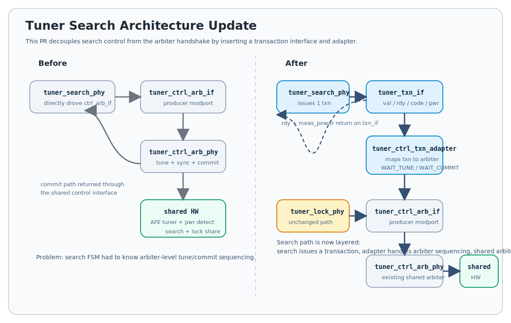

RTL Documentation
=================

This section provides an overview of the SystemVerilog RTL modules in the `lib/verilog/` directory.

.. contents::
   :local:

circuits
--------

The `circuits` directory contains basic analog and mixed-signal components.

*   **adc.sv**: An Analog-to-Digital Converter (ADC).
*   **dac.sv**: A Digital-to-Analog Converter (DAC).

photonics
---------

The `photonics` directory contains models for the optical components of the WDM system.

*   **wdm_pkg.sv**: A SystemVerilog package that defines data structures for handling Wavelength Division Multiplexing (WDM) data.
*   **laser.sv**: A multi-wavelength laser source.
*   **microring.sv**: A single microring resonator.
*   **microringrow.sv**: A row of microring resonators.
*   **photodetector.sv**: A photodetector to convert optical power to electrical current.

tuner
-----

The `tuner` directory contains the control logic for tuning the microring resonators.

*   **tuner_search_phy.sv**: Sweeps the tuning voltage to find resonance peaks.
*   **tuner_lock_phy.sv**: Locks the microring's resonance to a specific wavelength.
*   **tuner_ctrl_arb_phy.sv**: An arbiter to share the tuning and power detection hardware between the search and lock controllers.
*   **tuner_pwr_detect_phy.sv**: Detects the optical power from the photodetector.

Search Transaction Update
~~~~~~~~~~~~~~~~~~~~~~~~~

   Search path refactor from this PR. ``tuner_search_phy`` now issues a single
   transaction through ``tuner_txn_if`` and ``tuner_ctrl_txn_adapter`` instead
   of driving ``tuner_ctrl_arb_if`` directly. The lock path is unchanged.
