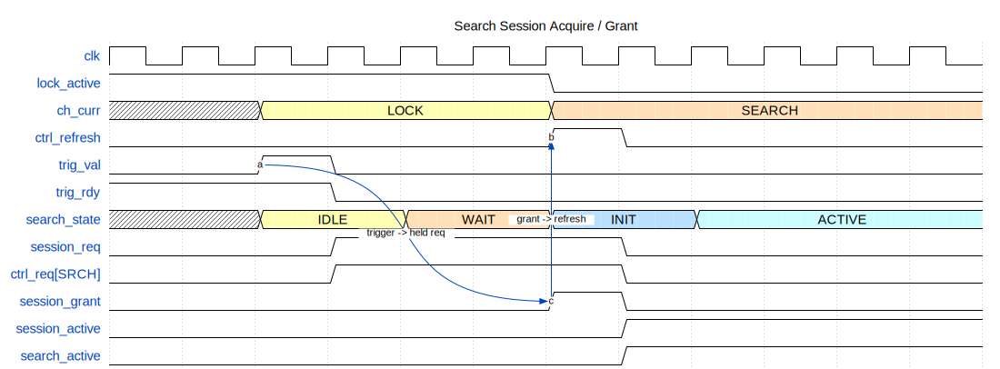
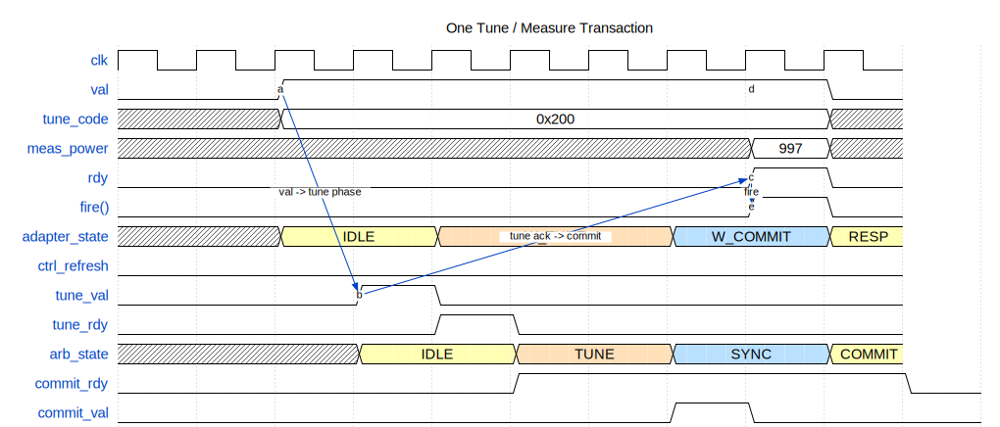
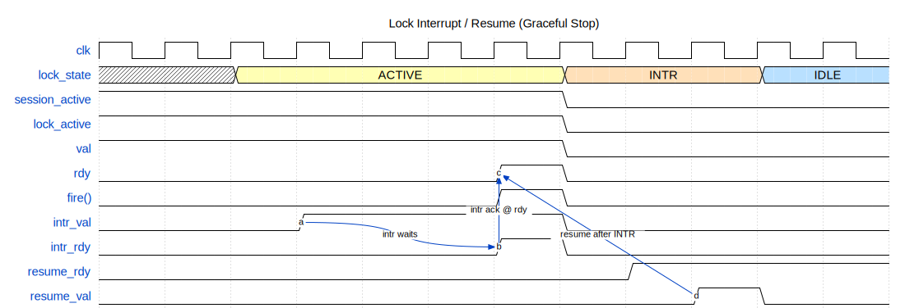

Tuner Handshakes
================

This page summarizes the active handshake structure in the tuner controller.
The diagrams are authored as WaveDrom source files under
``docs/_static/wavedrom/`` and rendered to static SVGs for the documentation.

Session Acquire / Grant
-----------------------

This figure shows a queued search request while lock still owns the plant. The
key points are:

- the controller enters ``WAIT_GRANT`` after trigger
- ``session_req`` and ``ctrl_req`` stay asserted while ownership is pending
- ``session_grant`` and ``ctrl_refresh`` pulse only when the arbiter actually
  grants the session
- ``session_active`` and ``ctrl_active`` rise only after grant

One Tune / Measure Transaction
------------------------------

This figure shows a single transaction inside an already-owned session. The
key points are:

- the controller presents ``txn_if.val`` with a tune code
- the adapter sequences ``WAIT_TUNE -> WAIT_COMMIT -> RESP``
- ``tune_val`` / ``tune_rdy`` perform the tune launch
- ``commit_rdy`` / ``commit_val`` return the measured response
- ``txn_if.fire()`` closes the transaction
- ``ctrl_refresh`` stays low for ordinary follow-on steps

Lock Interrupt / Resume
-----------------------

This figure shows the lock-specific graceful-stop behavior. The key points are:

- ``intr_val`` may be asserted before the current step is finished
- ``intr_rdy`` only rises when ``txn_if.rdy`` is high
- lock ownership is released at the transaction boundary
- ``resume`` is accepted from ``LOCK_INTR`` and returns the controller to idle

